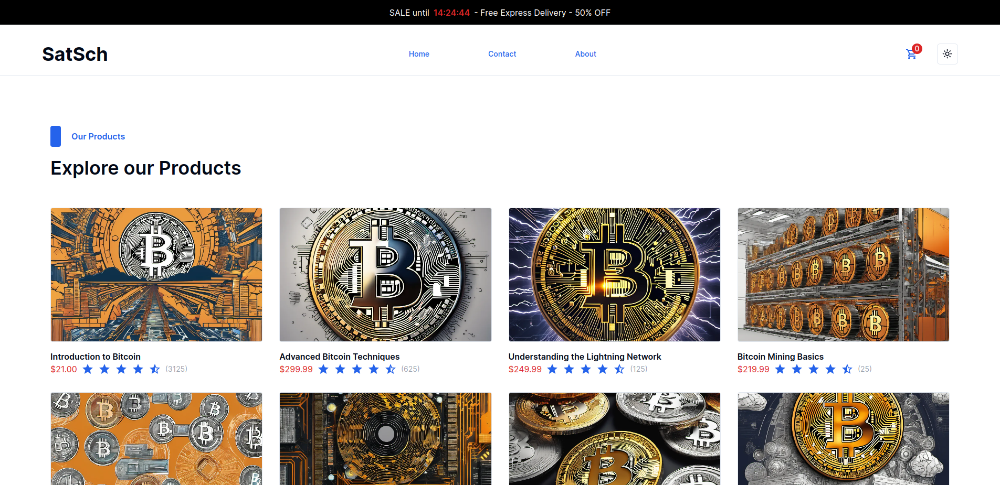

# SatSchool Fullstack Project

SatSchool ist a full-stack project built with Next.js.

The frontend is built with React, Tailwind CSS and shadcn/ui.

The backend's purpose is to connect the frontend with [Stripe](https://stripe.com/).

Hosted on [vercel.com](https://vercel.com/).

Live Preview: [SatSchool](https://satschool.vercel.app/)

## About the project

SatSchool is an ecommerce site.

The user can choose between various Bitcoin-related courses, adjust the quantity of the items in the shopping cart, and complete the payment using Stripe at the end of the shopping process.

### Features

- **Add Items to your cart:** Place your items in a shoppingcart and proceed to checkout after you have everything you need.

- **Pay with Stripe:** Pay conveniently with [Stripe](https://stripe.com/).

- **Dark/Light Theme:** Choose between dark and light mode.

### Technologies used

- [Nextjs](https://nextjs.org/)
- [React](https://react.dev/)
- [Tailwind CSS](https://tailwindcss.com/)
- [Shadcn](https://ui.shadcn.com/)

## Note

### Payment Process

The webshop is connected with a test database.

You can use the following credit card details:

- Email:Your Choice
- Credit Card: 4242 4242 4242 4242
- Date: 12/34
- CVC: 123
- Name: Your Choice

### Variables

- NEXT_PUBLIC_BASE_URL
- NEXT_PUBLIC_CHECKOUT_URL
- STRIPE_SECRET

### In development

- tests (front- and backend)
